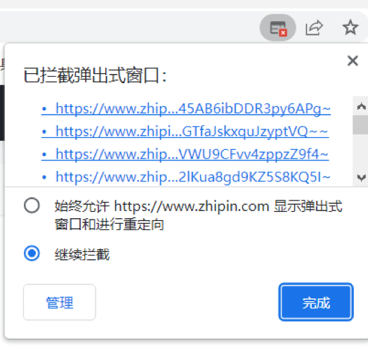

# Tampermonkey-BOSS
一个基于Tampermonkey实现的BOSS一键投递简历 

首先要介绍Tampermonkey，简单来说这是一个chrom扩展程序，可以帮我们执行js脚本，用我们的js脚本操作我们看到的页面 

下载地址：https://www.tampermonkey.net/index.php  

使用文档：https://www.tampermonkey.net/index.php?ext=dhdg&updated=true&version=4.18.1  

## 他有自己的脚本市场，也就是说你可以搜索一些你需要的脚本使用（很有意思），前提是注意安全，恶意的脚本可以侵犯你的隐私，并代表你进行其他操作

### BOSS一键投递简历使用方法

- 将instant-send.js的代码粘贴到Tampermonkey代码编辑器里面
- 打开[https://www.zhipin.com/web/geek/job?query=%E5%89%8D%E7%AB%AF&city=101020100&experience=102](https://www.zhipin.com/web/geek/job?query=前端&city=101020100&experience=102)
- 左边会出现批量投递按钮，点击按钮批量投递

# tips

因为要瞬间打开很多个标签页，浏览器自动做了拦截，所以建议阻止拦截 

  

对于前端开发来说这个很简单，如果不生效可能是BOSS改变了标签的类名，我们只需要打开控制台，看一下我们想要获取的元素和类名是不是一致就行了， 

如果不是前端开发工程师，那么你还可以去他的脚本市场搜索一下，相信我里面有很多有意思的东西，😎😎😎😎
